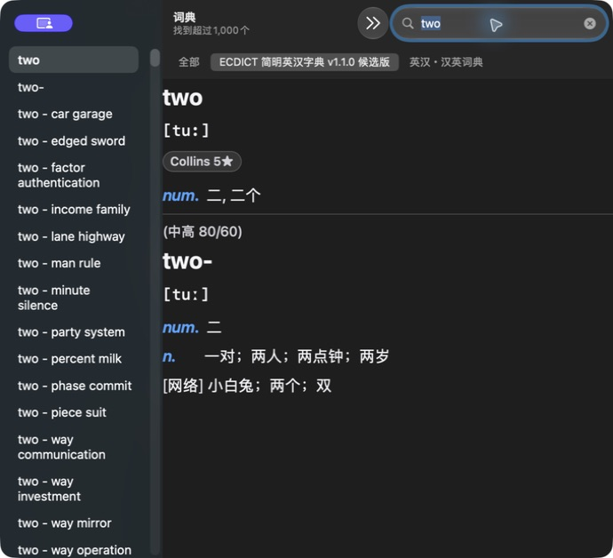
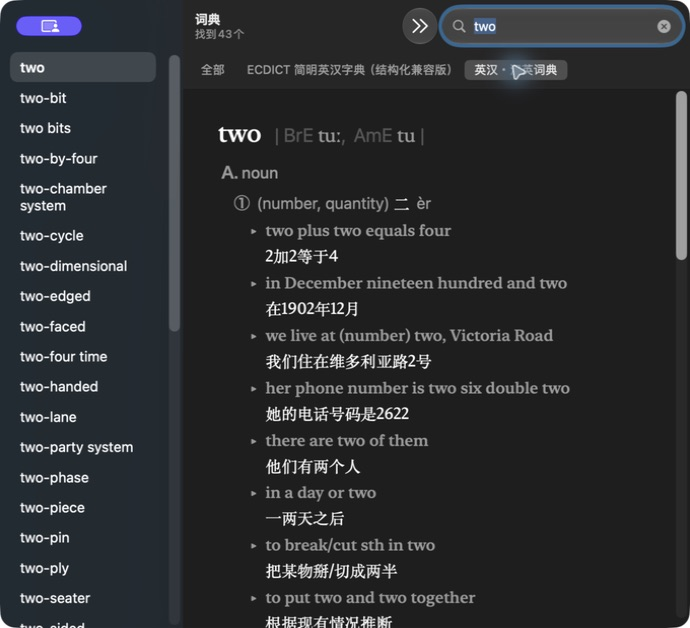

# ECDICT macOS Dictionary

[](https://github.com/343534-code/ecdict-macos-dictionary/releases/latest)
[](#系统要求)
[](LICENSE)

**把约 340 万条 ECDICT 英汉词条带入 macOS 原生查词体验。**

这是一款为 Apple 自带“词典”应用制作的大规模离线英汉词典。安装后无需打开浏览器，即可在 Dictionary.app、右键“查询”和触控板三指轻点中查看音标、词性与中文释义。数据保存在本机，不需联网、账号或常驻进程。

[下载最新版](https://github.com/343534-code/ecdict-macos-dictionary/releases/latest) · [安装指南](#macos-安装流程) · [常见问题](#常见问题) · [从源码构建](#从源码构建)

> [!IMPORTANT]
> 首次启用时，除了勾选“ECDICT 简明英汉字典”，还需在“词典”设置中至少勾选一个 macOS 系统自带词典。在部分 macOS 版本上，只启用第三方词典可能无法正常显示查询结果。

## 一行命令安装（推荐）

打开“终端”，粘贴下面一整行并按回车：

```bash
curl -fsSL https://raw.githubusercontent.com/343534-code/ecdict-macos-dictionary/v1.1.1/scripts/install.sh | /bin/bash
```

脚本会从 GitHub Releases 下载最新版、核对 SHA-256、备份同名旧版，并安装到当前用户的 `~/Library/Dictionaries/`，不需要管理员密码。脚本内容可在运行前先打开 [`scripts/install.sh`](scripts/install.sh) 审查。

## 三步安装

1. 从 [Releases](https://github.com/343534-code/ecdict-macos-dictionary/releases/latest) 下载 ZIP 并解压。
2. 把整个 `ECDICT 简明英汉字典.dictionary` 复制到 `~/Library/Dictionaries/`。
3. 打开 Mac“词典”→“设置…”（`Command-,`），勾选 ECDICT，并**同时勾选至少一个系统自带词典**。

首次安装、旧版清理和故障排查请参阅下方的[macOS 安装流程](#macos-安装流程)。

## 产品介绍

ECDICT macOS Dictionary 基于 [skywind3000/ECDICT](https://github.com/skywind3000/ECDICT) 1.0.28 数据制作，将上游 MDX 转换为 Apple `Dictionary.app` 可直接读取的 `.dictionary` 格式。它适合在阅读、写作、编程和学习时追求快速、安静且无广告查词体验的用户。

| 项目 | 说明 |
| --- | --- |
| 词典数据 | ECDICT 1.0.28，约 340 万条词条 |
| 查询方式 | Dictionary.app、三指轻点、右键“查询”及部分系统文本服务 |
| 词条内容 | 词头、音标、词性、中文释义、词频与考试标签 |
| 运行方式 | 完全离线，无账号、无广告、无常驻进程 |
| 其他格式 | 同时提供 MDX，可导入欧路词典、GoldenDict 和 MDict 等软件 |

## 实际查询效果

| ECDICT | macOS 系统自带词典 |
| --- | --- |
|  |  |

> ECDICT 截图来自 v1.1.0 在 macOS“词典”App 中查询 `two` 的实际运行画面，没有使用模拟或生成界面。正式 Release 的词典名称不含“候选版”。

安装后可通过以下入口查词：

- macOS 自带“词典”应用；
- 在支持的应用中选中单词后使用“查询”；
- 触控板三指轻点查询；
- 右键菜单中的“查询”；
- Spotlight 和部分系统级文本服务。

### 主要特点

- 收录单词、变形、短语、专有名词和大量扩展词目；
- 独立显示词头、音标、词性、中文释义和词频/考试标签；
- 采用适配 macOS 深色外观和快速查询面板的结构化样式；
- 词典数据完全保存在本机，不收集使用数据；
- 提供转换脚本和构建配置，便于审查、修改和复现。

## 系统要求

- macOS 10.11 或更高版本（构建目标；未逐一验证所有历史版本）；
- 约 500 MB 可用磁盘空间；
- 一行命令和 ZIP 安装不需要管理员密码；PKG 系统级安装需要管理员密码。

## 下载文件说明

请前往仓库的 [Releases](../../releases) 页面：

| 文件 | 用途 |
| --- | --- |
| `ECDICT-macOS-Dictionary-v1.1.1.zip` | 用户级 ZIP 安装包，无需管理员密码（推荐） |
| `ECDICT-macOS-Dictionary-v1.1.1.pkg` | 系统级图形化安装包，需要管理员密码（未签名） |
| `ECDICT-MDX-1.0.28.mdx` | 上游官方 MDX，适用于欧路词典、GoldenDict、MDict 等 |
| `SHA256SUMS.txt` | Release 附件的 SHA-256 校验值 |

### SHA-256 校验值

```text
c226933719eb01183e1fd3d12ec3bbc1aa91a66660914b3745c66486add333bc  ECDICT-macOS-Dictionary-v1.1.1.zip
6c22083484d51a34160111da384d46766b61b00ccec18c5162d2fc91f79e7a6a  ECDICT-macOS-Dictionary-v1.1.1.pkg
275e71b58fd359bfe649af1cbee533ea81770bdbc53ec4a34567f84720a5751b  ECDICT-MDX-1.0.28.mdx
```

## macOS 安装流程

### 安装前清理旧测试版（如果安装过）

1. 完全退出 macOS“词典”应用，不要只关闭窗口。
2. 在“词典”设置中取消勾选以前安装的 ECDICT 版本。
3. 前往 `~/Library/Dictionaries/`，移走名称中含“优化版”、“高对比版”或“结构化版”的旧 `.dictionary` 文件夹。

首次安装可直接跳过本节。

### 方法一：一行命令安装（推荐）

打开“终端”，执行：

```bash
curl -fsSL https://raw.githubusercontent.com/343534-code/ecdict-macos-dictionary/v1.1.1/scripts/install.sh | /bin/bash
```

脚本会自动完成下载、SHA-256 校验、旧版备份和用户级安装。完成后仍需打开“词典”→“设置…”，勾选 ECDICT 和至少一个系统自带词典。

### 方法二：通过访达安装

1. 下载 `ECDICT-macOS-Dictionary-v1.1.1.zip`。
2. 双击 ZIP 文件解压，得到 `ECDICT 简明英汉字典.dictionary`。
3. 完全退出 macOS“词典”应用（按 `Command-Q`）。
4. 在访达菜单中选择“前往”→“前往文件夹…”。
5. 输入 `~/Library/` 并按回车。
6. 打开其中的 `Dictionaries` 文件夹；如果不存在，请新建一个名为 `Dictionaries` 的文件夹。
7. 将整个 `ECDICT 简明英汉字典.dictionary` 复制进去，**不要只复制其中的 `Contents`**。
8. 重新打开 macOS“词典”，然后打开“词典”→“设置…”。
9. 在列表底部找到并勾选“ECDICT 简明英汉字典”。
10. **必须同时勾选至少一个 macOS 系统自带词典**，例如系统提供的英语词典或英汉词典。在部分 macOS 版本上，只勾选 ECDICT 可能无法显示释义。
11. 可将 ECDICT 拖到列表前部，使系统查询优先显示本词典。
12. 再次完全退出并重新打开“词典”，搜索 `two` 确认可以正常显示释义。

### 方法三：通过 PKG 图形化安装

1. 从 Releases 下载 `ECDICT-macOS-Dictionary-v1.1.1.pkg`。
2. 双击安装包，并按提示输入管理员密码。
3. 安装包会把词典放入系统级 `/Library/Dictionaries/`，供这台 Mac 的用户使用。
4. 打开“词典”→“设置…”，勾选 ECDICT，并同时勾选至少一个系统自带词典。

> [!WARNING]
> 当前 PKG 没有使用 Apple Developer Installer 证书签名。如果 macOS 阻止打开，请确认文件来自本仓库 Release 且 SHA-256 与上方一致，然后在“系统设置”→“隐私与安全性”中选择“仍要打开”。介意未签名安装包时，请使用一行命令或 ZIP 安装。

### 方法四：手动使用终端安装已解压的 ZIP

解压后执行：

```bash
mkdir -p "$HOME/Library/Dictionaries"
ditto "ECDICT 简明英汉字典.dictionary" \
  "$HOME/Library/Dictionaries/ECDICT 简明英汉字典.dictionary"
killall Dictionary DictionaryServiceHelper 2>/dev/null || true
```

随后打开“词典”→“设置…”，勾选该词典，并**同时勾选至少一个系统自带词典**。再次完全退出并重新打开“词典”，搜索 `two` 测试。

## 启用三指查询

1. 打开“系统设置”。
2. 进入“触控板”→“光标与点按”。
3. 开启“查询与数据检测器”。
4. 将操作方式设置为“三指轻点”。
5. 在 Safari、备忘录、TextEdit 或其他支持系统查询的应用中，把指针移到英文单词上并用三指轻点。

若查询浮窗没有显示本词典，请先确认它已在“词典”设置中勾选，并尝试将其拖到其他词典之前。

## 在欧路词典等软件中使用 MDX

1. 下载 `ECDICT-MDX-1.0.28.mdx`。
2. 在目标软件中打开“词典管理”或“导入词典”。
3. 选择下载的 `.mdx` 文件。
4. 启用词典并根据需要调整查询优先级。

不同软件的菜单名称可能不同，请参考对应软件的导入说明。

## 更新版本

1. 退出“词典”应用。
2. 删除或移走 `~/Library/Dictionaries/` 中的旧版本。
3. 将新版 `.dictionary` 文件夹复制到该目录。
4. 重新打开“词典”并确认新版已勾选。

如果同名旧版仍被缓存，可先将旧版取消勾选，退出“词典”，再安装新版。

## 卸载

1. 打开“词典”→“设置…”，取消勾选本词典。
2. 退出“词典”。
3. 在访达中前往 `~/Library/Dictionaries/`。
4. 将对应 `.dictionary` 文件夹移到废纸篓。
5. 重新打开“词典”。

## 常见问题

### 安装后找不到词典

- 确认复制的是完整 `.dictionary` 文件夹；
- 确认路径是当前用户的 `~/Library/Dictionaries/`；
- 完全退出并重新打开“词典”；
- 在“词典”→“设置…”列表底部查找并手动勾选；
- 必要时注销并重新登录 macOS。

### 能看到 ECDICT，但查询不正常

- 打开“词典”→“设置…”；
- 确认“ECDICT 简明英汉字典”已勾选；
- 再至少勾选一个 macOS 系统自带词典；
- 完全退出“词典”并重新打开，然后再次查询。

这是部分 macOS 版本加载第三方词典时的兼容性要求，不代表 ECDICT 需要联网。

如果仍无法显示释义，请检查 `~/Library/Dictionaries/` 中是否还存在以前的 ECDICT 测试版；移走旧版后，再次完全退出并重新打开“词典”。

### 三指查询没有出现 ECDICT

系统查询只使用“词典”设置中已启用的来源。请勾选本词典，并将它拖到靠前位置。已经打开的查询浮窗不会即时刷新，需要关闭后重新触发。

### 音标颜色与 Dictionary.app 不完全一致

macOS 的三指查询浮窗会过滤或覆盖第三方词典的部分 CSS。Dictionary.app 中能看到完整排版；快速查询浮窗中的颜色可能随系统版本和外观模式变化。

### 为什么安装包很大

词典包含约 340 万条索引和离线正文。解压后的 `.dictionary` 大约 416 MB，属于正常体积。

## 从源码构建

构建需要：

- Python 3；
- `readmdict==0.1.1` 和 `python-lzo==1.15`；
- LZO 系统库（Homebrew 用户可执行 `brew install lzo`）；
- Apple Dictionary Development Kit；
- 上游 ECDICT MDX 文件。

先安装 LZO 系统库，再安装已锁定的 Python 依赖：

```bash
brew install lzo
python3 -m pip install -r requirements.txt
```

导出结构化 XML：

```bash
python3 scripts/export_ecdict_styled.py \
  "简明英汉字典增强版.mdx" \
  "dictionary-source/ECDICT-styled.xml"
```

然后进入 `dictionary-source`，确认 Makefile 中的 Dictionary Development Kit 路径，再运行：

```bash
make all
```

成品会生成在 `dictionary-source/objects/`。完整构建需要较长时间和数 GB 临时磁盘空间。

Apple 已不再面向普通用户维护 Dictionary Development Kit，因此不同 macOS 版本的构建兼容性可能有所差异。Apple 开发工具本身不包含在本仓库中。

## 项目结构

```text
dictionary-source/       样式、XSL、偏好设置、Info.plist 和 Makefile
scripts/                 MDX 到 Apple Dictionary XML 的转换脚本
requirements.txt         已锁定的 Python 构建依赖
LICENSE                  ECDICT 1.0.28 的 MIT License
NOTICE                   数据来源和非官方声明
```

## 来源与许可证

词典数据和上游 MDX 来自 [ECDICT 1.0.28](https://github.com/skywind3000/ECDICT/releases/tag/1.0.28)。本仓库保留该版本中 `Copyright (c) 2017 Linwei` 的 MIT License 许可声明；MDX 内嵌说明另外将数据描述为“MIT / CC”双协议，但未指明具体 CC 版本。本仓库以已保留的 MIT 文本作为再分发依据，转换脚本和排版修改也按同一 MIT License 提供。

本项目是非官方转换版本，与 Apple Inc. 及 ECDICT 原作者均无隶属、合作或背书关系。词典内容按原许可证“按原样”提供，不保证所有释义均准确或适合专业用途。
